# DataFlow.Example

*TLDR: the different methods are within the Features folder*

 There are various approaches to process data efficiently, each with its own trade-offs. In this demo, I have created three different strategies: TPL Dataflow, which utilizes a network of concurrently executing blocks; Semaphore-based control, which simply limits the number of tasks running in parallel; and Single-threaded processing, which executes tasks sequentially without any concurrency.

### Dataflow

* **Concurrency Model:** Dataflow employs a message-passing model where data moves through a network of linked blocks, and each block can process data concurrently up to a defined limit.
* **Composition:** Easy to create complex processing pipelines by linking multiple blocks. This provides clear separation of concerns for different stages of processing.
* **Scalability:** Can be highly scalable and can efficiently utilize resources, especially for I/O-bound operations.
* **Control:** Provides fine-grained control over how data moves through the blocks and how concurrency is managed.
* **Use Case:** Well-suited for scenarios where there are multiple stages of processing and there is a need for efficient management of resources.

### Semaphore

* **Concurrency Model:** Uses semaphore to limit the number of concurrent tasks. Multiple tasks can be run in parallel but the number of executing tasks is capped.
* **Composition:** The logic is often written inline and can be less modular compared to Dataflow.
* **Scalability:** Scalability is good but requires manual management compared to the automatic handling by Dataflow.
* **Control:** Provides control over concurrency, but less control over data flow compared to Dataflow.
* **Use Case:** Suited for scenarios where you want to limit the number of concurrent tasks to prevent resource contention, but do not necessarily need the structured pipeline that Dataflow offers.

### Single-threaded processing

* **Concurrency Model:** Processes tasks one at a time on a single thread.
* **Composition:** Like the Semaphore approach, logic is usually written inline.
* **Scalability:** Not scalable. Processing time increases linearly with the number of tasks.
* **Control:** Simple control, as there is no concurrency or parallelism.
* **Use Case:** Good for simple scenarios where the data processing is not resource-intensive, or where concurrency and parallelism would not offer substantial benefits. Also, easier to debug.

## K6 Load Testing

This load testing was performed with K6 under the scenario of 10 max Virtual Users (VUs) and a maximum duration of 1 minute 30 seconds, including a graceful stop of 30 seconds. Three different processing strategies were evaluated: Single Process, Semaphore Process, and Dataflow Process. The evaluation measures their performance in handling HTTP requests.

### Single Process

* **Status:** 100% success rate (200 OK)
* **Data Received:** 32 kB
* **Data Sent:** 15 kB
* **Number of HTTP Requests:** 140
* **Average Request Duration:** 4.77 seconds
* **Average Iteration Duration:** 9.55 seconds
* **Throughput:** Approximately 2.09 requests/second
* **Number of Iterations:** 70
* **VUs:** 10

### Semaphore Process

* **Status:** 100% success rate (200 OK)
* **Data Received:** 91 kB
* **Data Sent:** 50 kB
* **Number of HTTP Requests:** 620
* **Average Request Duration:** 985.12 milliseconds
* **Average Iteration Duration:** 1.97 seconds
* **Throughput:** Approximately 10.15 requests/second
* **Number of Iterations:** 310
* **VUs:** 10

### Dataflow Process

* **Status:** 100% success rate (200 OK)
* **Data Received:** 181 kB
* **Data Sent:** 94 kB
* **Number of HTTP Requests:** 1260
* **Average Request Duration:** 478.04 milliseconds
* **Average Iteration Duration:** 956.44 milliseconds
* **Throughput:** Approximately 20.83 requests/second
* **Number of Iterations:** 630
* **VUs:** 10

Comparing the three processing strategies, it is clear that the Dataflow Process has the highest throughput, processing requests more than twice as fast as the Semaphore Process, and ten times faster than the Single Process. 

## Gantt Diagrams

The following diagrams illustrate three different approaches to processing data: a single-threaded process, a semaphore-controlled process that limits concurrency to 4 concurrent tasks, and a dataflow process where each block is allowed to process up to 4 tasks concurrently. Each approach executes a set process in which it:
1. retreives *n* amount of data (130ms simulated I/O per req(1))
2. transforms that data into *n*\*10 items (300ms simulated CPU per req(*n*))
3. saves those items (30ms simulated I/O per req(*n*\*10))

```mermaid
    gantt
        title Dataflow process (10)
        dateFormat x
        axisFormat %L
        section Dataflow
            GetDataAsync (20) : 24, 80ms
            TransformDataAsync (0) :crit, 116, 35ms
            TransformDataAsync (3) :crit, 116, 35ms
            TransformDataAsync (2) :crit, 116, 35ms
            TransformDataAsync (1) :crit, 116, 35ms
            TransformDataAsync (4) :crit, 153, 44ms
            TransformDataAsync (5) :crit, 153, 44ms
            TransformDataAsync (7) :crit, 153, 44ms
            TransformDataAsync (6) :crit, 153, 44ms
            TransformDataAsync (10) :crit, 197, 30ms
            TransformDataAsync (11) :crit, 197, 30ms
            TransformDataAsync (8) :crit, 197, 30ms
            TransformDataAsync (9) :crit, 197, 30ms
            SaveDataAsync (0) : 161, 71ms
            SaveDataAsync (0) : 161, 71ms
            SaveDataAsync (1) : 161, 71ms
            SaveDataAsync (3) : 163, 71ms
            SaveDataAsync (1) : 162, 72ms
            SaveDataAsync (2) : 163, 72ms
            SaveDataAsync (2) : 163, 72ms
            SaveDataAsync (3) : 165, 71ms
            TransformDataAsync (12) :crit, 229, 32ms
            TransformDataAsync (13) :crit, 229, 32ms
            TransformDataAsync (14) :crit, 229, 33ms
            TransformDataAsync (15) :crit, 232, 31ms
            SaveDataAsync (4) : 197, 78ms
            SaveDataAsync (6) : 198, 77ms
            SaveDataAsync (6) : 197, 78ms
            SaveDataAsync (5) : 197, 78ms
            SaveDataAsync (7) : 198, 77ms
            SaveDataAsync (5) : 197, 78ms
            SaveDataAsync (7) : 198, 77ms
            SaveDataAsync (4) : 197, 78ms
            PostTelemetry (0) : 234, 57ms
            PostTelemetry (3) : 236, 55ms
            PostTelemetry (2) : 236, 55ms
            PostTelemetry (3) : 236, 55ms
            PostTelemetry (1) : 236, 55ms
            PostTelemetry (0) : 234, 57ms
            PostTelemetry (1) : 234, 57ms
            PostTelemetry (2) : 236, 55ms
            TransformDataAsync (16) :crit, 261, 44ms
            TransformDataAsync (17) :crit, 261, 44ms
            TransformDataAsync (19) :crit, 263, 43ms
            TransformDataAsync (18) :crit, 263, 43ms
            SaveDataAsync (10) : 232, 74ms
            SaveDataAsync (10) : 232, 74ms
            SaveDataAsync (11) : 232, 74ms
            SaveDataAsync (11) : 232, 74ms
            SaveDataAsync (8) : 230, 76ms
            SaveDataAsync (9) : 231, 75ms
            SaveDataAsync (8) : 230, 76ms
            SaveDataAsync (9) : 230, 76ms
            SaveDataAsync (12) : 262, 75ms
            PostTelemetry (7) : 276, 61ms
            PostTelemetry (7) : 276, 61ms
            PostTelemetry (6) : 276, 61ms
            PostTelemetry (6) : 276, 61ms
            PostTelemetry (5) : 276, 61ms
            SaveDataAsync (15) : 263, 74ms
            SaveDataAsync (15) : 263, 74ms
            SaveDataAsync (12) : 262, 75ms
            PostTelemetry (4) : 276, 61ms
            SaveDataAsync (14) : 263, 74ms
            SaveDataAsync (13) : 263, 74ms
            SaveDataAsync (13) : 263, 74ms
            PostTelemetry (4) : 276, 61ms
            PostTelemetry (5) : 276, 61ms
            SaveDataAsync (14) : 263, 74ms
            PostTelemetry (11) : 310, 58ms
            PostTelemetry (11) : 310, 58ms
            PostTelemetry (9) : 310, 58ms
            PostTelemetry (8) : 308, 61ms
            PostTelemetry (10) : 310, 58ms
            PostTelemetry (8) : 308, 61ms
            PostTelemetry (10) : 310, 59ms
            PostTelemetry (9) : 308, 61ms
            SaveDataAsync (16) : 306, 78ms
            SaveDataAsync (17) : 306, 78ms
            SaveDataAsync (16) : 306, 79ms
            SaveDataAsync (17) : 306, 79ms
            SaveDataAsync (18) : 306, 79ms
            SaveDataAsync (19) : 307, 78ms
            SaveDataAsync (19) : 306, 79ms
            SaveDataAsync (18) : 306, 79ms
            PostTelemetry (13) : 337, 50ms
            PostTelemetry (12) : 337, 50ms
            PostTelemetry (12) : 337, 50ms
            PostTelemetry (13) : 337, 50ms
```

