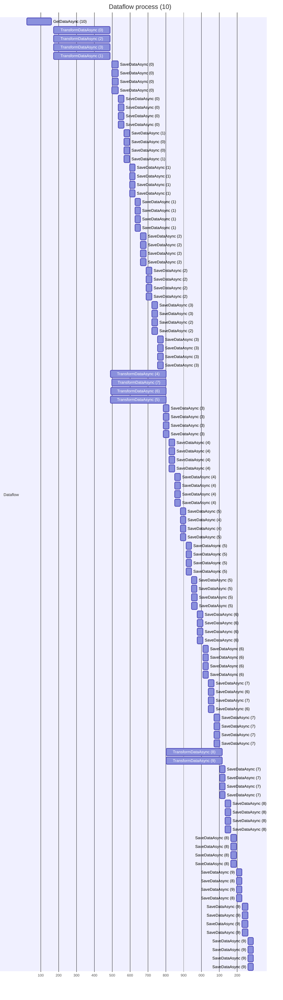

```mermaid
    gantt
        title Dataflow process (10)
        dateFormat x
        axisFormat %L
        section Dataflow
            GetDataAsync (10) : 21, 139ms
            TransformDataAsync (0) : 172, 315ms
            TransformDataAsync (2) : 172, 315ms
            TransformDataAsync (3) : 172, 315ms
            TransformDataAsync (1) : 172, 315ms
            SaveDataAsync (0) : 497, 37ms
            SaveDataAsync (0) : 497, 37ms
            SaveDataAsync (0) : 499, 35ms
            SaveDataAsync (0) : 497, 37ms
            SaveDataAsync (0) : 534, 31ms
            SaveDataAsync (0) : 534, 31ms
            SaveDataAsync (0) : 534, 31ms
            SaveDataAsync (0) : 534, 31ms
            SaveDataAsync (1) : 565, 32ms
            SaveDataAsync (0) : 565, 32ms
            SaveDataAsync (0) : 565, 32ms
            SaveDataAsync (1) : 565, 32ms
            SaveDataAsync (1) : 597, 31ms
            SaveDataAsync (1) : 597, 31ms
            SaveDataAsync (1) : 597, 31ms
            SaveDataAsync (1) : 597, 31ms
            SaveDataAsync (1) : 628, 31ms
            SaveDataAsync (1) : 628, 31ms
            SaveDataAsync (1) : 628, 31ms
            SaveDataAsync (1) : 628, 31ms
            SaveDataAsync (2) : 659, 31ms
            SaveDataAsync (2) : 659, 31ms
            SaveDataAsync (2) : 659, 31ms
            SaveDataAsync (2) : 659, 31ms
            SaveDataAsync (2) : 691, 31ms
            SaveDataAsync (2) : 690, 32ms
            SaveDataAsync (2) : 690, 32ms
            SaveDataAsync (2) : 690, 32ms
            SaveDataAsync (3) : 722, 33ms
            SaveDataAsync (3) : 722, 33ms
            SaveDataAsync (2) : 722, 33ms
            SaveDataAsync (2) : 722, 33ms
            SaveDataAsync (3) : 755, 32ms
            SaveDataAsync (3) : 755, 32ms
            SaveDataAsync (3) : 755, 32ms
            SaveDataAsync (3) : 755, 32ms
            TransformDataAsync (4) : 489, 314ms
            TransformDataAsync (7) : 497, 306ms
            TransformDataAsync (6) : 491, 312ms
            TransformDataAsync (5) : 489, 314ms
            SaveDataAsync (3) : 787, 32ms
            SaveDataAsync (3) : 787, 32ms
            SaveDataAsync (3) : 787, 32ms
            SaveDataAsync (3) : 787, 32ms
            SaveDataAsync (4) : 819, 31ms
            SaveDataAsync (4) : 819, 31ms
            SaveDataAsync (4) : 819, 31ms
            SaveDataAsync (4) : 819, 31ms
            SaveDataAsync (4) : 851, 31ms
            SaveDataAsync (4) : 850, 32ms
            SaveDataAsync (4) : 851, 31ms
            SaveDataAsync (4) : 850, 32ms
            SaveDataAsync (5) : 882, 31ms
            SaveDataAsync (4) : 882, 31ms
            SaveDataAsync (4) : 882, 31ms
            SaveDataAsync (5) : 882, 31ms
            SaveDataAsync (5) : 914, 31ms
            SaveDataAsync (5) : 914, 31ms
            SaveDataAsync (5) : 914, 31ms
            SaveDataAsync (5) : 914, 31ms
            SaveDataAsync (5) : 945, 30ms
            SaveDataAsync (5) : 945, 30ms
            SaveDataAsync (5) : 945, 31ms
            SaveDataAsync (5) : 945, 31ms
            SaveDataAsync (6) : 976, 32ms
            SaveDataAsync (6) : 976, 32ms
            SaveDataAsync (6) : 976, 32ms
            SaveDataAsync (6) : 976, 32ms
            SaveDataAsync (6) : 1008, 31ms
            SaveDataAsync (6) : 1008, 31ms
            SaveDataAsync (6) : 1008, 31ms
            SaveDataAsync (6) : 1008, 31ms
            SaveDataAsync (7) : 1039, 32ms
            SaveDataAsync (6) : 1039, 32ms
            SaveDataAsync (7) : 1039, 32ms
            SaveDataAsync (6) : 1039, 32ms
            SaveDataAsync (7) : 1071, 31ms
            SaveDataAsync (7) : 1071, 31ms
            SaveDataAsync (7) : 1071, 31ms
            SaveDataAsync (7) : 1071, 31ms
            TransformDataAsync (8) : 803, 314ms
            TransformDataAsync (9) : 803, 314ms
            SaveDataAsync (7) : 1102, 31ms
            SaveDataAsync (7) : 1102, 31ms
            SaveDataAsync (7) : 1102, 31ms
            SaveDataAsync (7) : 1102, 31ms
            SaveDataAsync (8) : 1133, 31ms
            SaveDataAsync (8) : 1133, 31ms
            SaveDataAsync (8) : 1133, 31ms
            SaveDataAsync (8) : 1133, 31ms
            SaveDataAsync (8) : 1165, 31ms
            SaveDataAsync (8) : 1165, 31ms
            SaveDataAsync (8) : 1165, 31ms
            SaveDataAsync (8) : 1164, 32ms
            SaveDataAsync (9) : 1196, 31ms
            SaveDataAsync (8) : 1196, 31ms
            SaveDataAsync (9) : 1196, 31ms
            SaveDataAsync (8) : 1196, 31ms
            SaveDataAsync (9) : 1228, 32ms
            SaveDataAsync (9) : 1228, 32ms
            SaveDataAsync (9) : 1227, 33ms
            SaveDataAsync (9) : 1228, 32ms
            SaveDataAsync (9) : 1260, 31ms
            SaveDataAsync (9) : 1260, 31ms
            SaveDataAsync (9) : 1260, 31ms
            SaveDataAsync (9) : 1260, 31ms
```