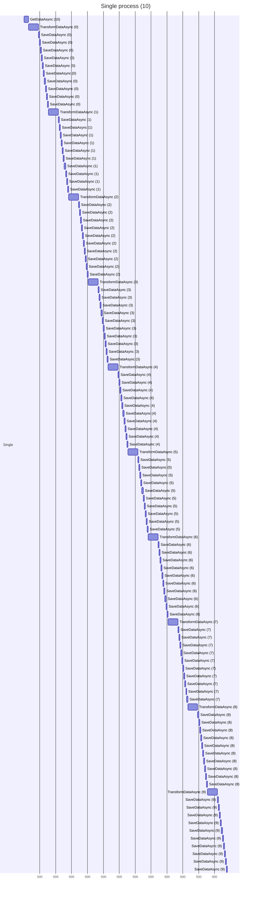
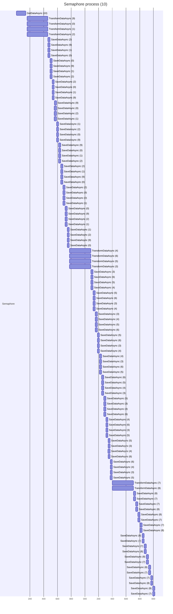
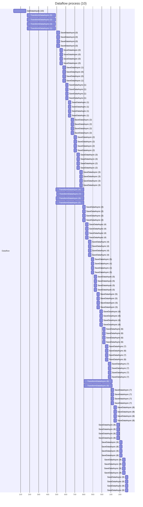

```mermaid
    gantt
        title Single process (10)
        dateFormat x
        axisFormat %L
        section Single
            GetDataAsync (10) : 1, 137ms
            TransformDataAsync (0) : 144, 307ms
            SaveDataAsync (0) : 452, 31ms
            SaveDataAsync (0) : 483, 32ms
            SaveDataAsync (0) : 516, 31ms
            SaveDataAsync (0) : 547, 31ms
            SaveDataAsync (0) : 578, 33ms
            SaveDataAsync (0) : 611, 31ms
            SaveDataAsync (0) : 642, 31ms
            SaveDataAsync (0) : 673, 31ms
            SaveDataAsync (0) : 704, 32ms
            SaveDataAsync (0) : 736, 31ms
            TransformDataAsync (1) : 768, 310ms
            SaveDataAsync (1) : 1078, 31ms
            SaveDataAsync (1) : 1109, 31ms
            SaveDataAsync (1) : 1140, 30ms
            SaveDataAsync (1) : 1171, 30ms
            SaveDataAsync (1) : 1201, 30ms
            SaveDataAsync (1) : 1232, 32ms
            SaveDataAsync (1) : 1264, 45ms
            SaveDataAsync (1) : 1309, 32ms
            SaveDataAsync (1) : 1342, 30ms
            SaveDataAsync (1) : 1373, 30ms
            TransformDataAsync (2) : 1403, 310ms
            SaveDataAsync (2) : 1713, 31ms
            SaveDataAsync (2) : 1744, 31ms
            SaveDataAsync (2) : 1775, 32ms
            SaveDataAsync (2) : 1807, 31ms
            SaveDataAsync (2) : 1838, 31ms
            SaveDataAsync (2) : 1869, 31ms
            SaveDataAsync (2) : 1900, 30ms
            SaveDataAsync (2) : 1930, 31ms
            SaveDataAsync (2) : 1961, 31ms
            SaveDataAsync (2) : 1992, 32ms
            TransformDataAsync (3) : 2024, 311ms
            SaveDataAsync (3) : 2335, 30ms
            SaveDataAsync (3) : 2365, 32ms
            SaveDataAsync (3) : 2397, 31ms
            SaveDataAsync (3) : 2428, 32ms
            SaveDataAsync (3) : 2460, 31ms
            SaveDataAsync (3) : 2491, 31ms
            SaveDataAsync (3) : 2522, 32ms
            SaveDataAsync (3) : 2554, 31ms
            SaveDataAsync (3) : 2585, 31ms
            SaveDataAsync (3) : 2616, 31ms
            TransformDataAsync (4) : 2648, 310ms
            SaveDataAsync (4) : 2958, 32ms
            SaveDataAsync (4) : 2990, 31ms
            SaveDataAsync (4) : 3021, 31ms
            SaveDataAsync (4) : 3052, 31ms
            SaveDataAsync (4) : 3084, 31ms
            SaveDataAsync (4) : 3115, 31ms
            SaveDataAsync (4) : 3146, 31ms
            SaveDataAsync (4) : 3177, 31ms
            SaveDataAsync (4) : 3209, 30ms
            SaveDataAsync (4) : 3239, 31ms
            TransformDataAsync (5) : 3270, 312ms
            SaveDataAsync (5) : 3583, 31ms
            SaveDataAsync (5) : 3614, 31ms
            SaveDataAsync (5) : 3645, 31ms
            SaveDataAsync (5) : 3676, 31ms
            SaveDataAsync (5) : 3707, 45ms
            SaveDataAsync (5) : 3752, 31ms
            SaveDataAsync (5) : 3783, 31ms
            SaveDataAsync (5) : 3814, 30ms
            SaveDataAsync (5) : 3844, 32ms
            SaveDataAsync (5) : 3876, 31ms
            TransformDataAsync (6) : 3907, 312ms
            SaveDataAsync (6) : 4219, 32ms
            SaveDataAsync (6) : 4251, 31ms
            SaveDataAsync (6) : 4282, 31ms
            SaveDataAsync (6) : 4313, 31ms
            SaveDataAsync (6) : 4344, 32ms
            SaveDataAsync (6) : 4376, 30ms
            SaveDataAsync (6) : 4406, 30ms
            SaveDataAsync (6) : 4437, 31ms
            SaveDataAsync (6) : 4468, 31ms
            SaveDataAsync (6) : 4499, 32ms
            TransformDataAsync (7) : 4531, 313ms
            SaveDataAsync (7) : 4844, 31ms
            SaveDataAsync (7) : 4875, 30ms
            SaveDataAsync (7) : 4905, 31ms
            SaveDataAsync (7) : 4937, 31ms
            SaveDataAsync (7) : 4968, 31ms
            SaveDataAsync (7) : 4999, 31ms
            SaveDataAsync (7) : 5030, 32ms
            SaveDataAsync (7) : 5062, 31ms
            SaveDataAsync (7) : 5094, 30ms
            SaveDataAsync (7) : 5124, 31ms
            TransformDataAsync (8) : 5155, 311ms
            SaveDataAsync (8) : 5467, 31ms
            SaveDataAsync (8) : 5498, 32ms
            SaveDataAsync (8) : 5530, 31ms
            SaveDataAsync (8) : 5561, 31ms
            SaveDataAsync (8) : 5592, 31ms
            SaveDataAsync (8) : 5623, 31ms
            SaveDataAsync (8) : 5654, 30ms
            SaveDataAsync (8) : 5684, 31ms
            SaveDataAsync (8) : 5715, 31ms
            SaveDataAsync (8) : 5746, 31ms
            TransformDataAsync (9) : 5777, 312ms
            SaveDataAsync (9) : 6089, 33ms
            SaveDataAsync (9) : 6122, 30ms
            SaveDataAsync (9) : 6152, 31ms
            SaveDataAsync (9) : 6183, 31ms
            SaveDataAsync (9) : 6214, 32ms
            SaveDataAsync (9) : 6246, 31ms
            SaveDataAsync (9) : 6277, 32ms
            SaveDataAsync (9) : 6309, 30ms
            SaveDataAsync (9) : 6339, 32ms
            SaveDataAsync (9) : 6371, 30ms
```

```mermaid
    gantt
        title Semaphore process (10)
        dateFormat x
        axisFormat %L
        section Semaphore
            GetDataAsync (10) : 1, 136ms
            TransformDataAsync (9) : 156, 303ms
            TransformDataAsync (0) : 156, 303ms
            TransformDataAsync (1) : 156, 303ms
            TransformDataAsync (2) : 156, 303ms
            SaveDataAsync (2) : 460, 31ms
            SaveDataAsync (9) : 460, 31ms
            SaveDataAsync (1) : 460, 31ms
            SaveDataAsync (0) : 460, 31ms
            SaveDataAsync (0) : 491, 31ms
            SaveDataAsync (9) : 491, 31ms
            SaveDataAsync (1) : 491, 31ms
            SaveDataAsync (2) : 491, 31ms
            SaveDataAsync (2) : 522, 31ms
            SaveDataAsync (0) : 522, 31ms
            SaveDataAsync (1) : 522, 31ms
            SaveDataAsync (9) : 522, 31ms
            SaveDataAsync (9) : 554, 32ms
            SaveDataAsync (0) : 553, 33ms
            SaveDataAsync (2) : 553, 33ms
            SaveDataAsync (1) : 553, 33ms
            SaveDataAsync (1) : 586, 31ms
            SaveDataAsync (2) : 586, 31ms
            SaveDataAsync (0) : 586, 31ms
            SaveDataAsync (9) : 586, 31ms
            SaveDataAsync (9) : 617, 31ms
            SaveDataAsync (0) : 617, 31ms
            SaveDataAsync (1) : 617, 31ms
            SaveDataAsync (2) : 617, 31ms
            SaveDataAsync (2) : 649, 31ms
            SaveDataAsync (1) : 648, 32ms
            SaveDataAsync (9) : 648, 32ms
            SaveDataAsync (0) : 648, 32ms
            SaveDataAsync (2) : 680, 31ms
            SaveDataAsync (9) : 680, 31ms
            SaveDataAsync (0) : 680, 31ms
            SaveDataAsync (1) : 680, 31ms
            SaveDataAsync (0) : 712, 30ms
            SaveDataAsync (9) : 711, 31ms
            SaveDataAsync (2) : 711, 31ms
            SaveDataAsync (1) : 712, 31ms
            SaveDataAsync (1) : 743, 30ms
            SaveDataAsync (2) : 743, 30ms
            SaveDataAsync (9) : 743, 30ms
            SaveDataAsync (0) : 743, 30ms
            TransformDataAsync (4) : 774, 312ms
            TransformDataAsync (6) : 774, 312ms
            TransformDataAsync (5) : 774, 312ms
            TransformDataAsync (3) : 774, 312ms
            SaveDataAsync (3) : 1086, 32ms
            SaveDataAsync (6) : 1086, 32ms
            SaveDataAsync (5) : 1086, 32ms
            SaveDataAsync (4) : 1086, 32ms
            SaveDataAsync (5) : 1118, 32ms
            SaveDataAsync (6) : 1118, 32ms
            SaveDataAsync (3) : 1118, 32ms
            SaveDataAsync (4) : 1118, 32ms
            SaveDataAsync (3) : 1150, 32ms
            SaveDataAsync (4) : 1150, 32ms
            SaveDataAsync (5) : 1150, 32ms
            SaveDataAsync (6) : 1150, 32ms
            SaveDataAsync (5) : 1182, 31ms
            SaveDataAsync (6) : 1182, 31ms
            SaveDataAsync (3) : 1182, 31ms
            SaveDataAsync (4) : 1182, 31ms
            SaveDataAsync (4) : 1213, 30ms
            SaveDataAsync (3) : 1213, 30ms
            SaveDataAsync (6) : 1213, 30ms
            SaveDataAsync (5) : 1213, 30ms
            SaveDataAsync (6) : 1243, 32ms
            SaveDataAsync (5) : 1243, 32ms
            SaveDataAsync (4) : 1243, 32ms
            SaveDataAsync (3) : 1243, 32ms
            SaveDataAsync (5) : 1275, 31ms
            SaveDataAsync (3) : 1275, 31ms
            SaveDataAsync (4) : 1275, 31ms
            SaveDataAsync (6) : 1275, 31ms
            SaveDataAsync (4) : 1306, 31ms
            SaveDataAsync (6) : 1307, 30ms
            SaveDataAsync (3) : 1306, 31ms
            SaveDataAsync (5) : 1306, 31ms
            SaveDataAsync (5) : 1338, 31ms
            SaveDataAsync (3) : 1338, 31ms
            SaveDataAsync (4) : 1337, 32ms
            SaveDataAsync (6) : 1338, 31ms
            SaveDataAsync (6) : 1370, 30ms
            SaveDataAsync (4) : 1370, 30ms
            SaveDataAsync (3) : 1370, 30ms
            SaveDataAsync (5) : 1369, 31ms
            TransformDataAsync (7) : 1400, 310ms
            TransformDataAsync (8) : 1400, 310ms
            SaveDataAsync (8) : 1710, 31ms
            SaveDataAsync (7) : 1710, 31ms
            SaveDataAsync (7) : 1741, 32ms
            SaveDataAsync (8) : 1741, 32ms
            SaveDataAsync (8) : 1773, 31ms
            SaveDataAsync (7) : 1773, 31ms
            SaveDataAsync (7) : 1804, 31ms
            SaveDataAsync (8) : 1804, 31ms
            SaveDataAsync (8) : 1835, 31ms
            SaveDataAsync (7) : 1835, 31ms
            SaveDataAsync (7) : 1866, 32ms
            SaveDataAsync (8) : 1866, 32ms
            SaveDataAsync (8) : 1898, 31ms
            SaveDataAsync (7) : 1898, 31ms
            SaveDataAsync (8) : 1929, 30ms
            SaveDataAsync (7) : 1929, 30ms
            SaveDataAsync (7) : 1960, 30ms
            SaveDataAsync (8) : 1959, 31ms
            SaveDataAsync (8) : 1990, 31ms
            SaveDataAsync (7) : 1990, 31ms
```

```mermaid
    gantt
        title Dataflow process (10)
        dateFormat x
        axisFormat %L
        section Dataflow
            GetDataAsync (10) : 21, 139ms
            TransformDataAsync (0) : 172, 315ms
            TransformDataAsync (2) : 172, 315ms
            TransformDataAsync (3) : 172, 315ms
            TransformDataAsync (1) : 172, 315ms
            SaveDataAsync (0) : 497, 37ms
            SaveDataAsync (0) : 497, 37ms
            SaveDataAsync (0) : 499, 35ms
            SaveDataAsync (0) : 497, 37ms
            SaveDataAsync (0) : 534, 31ms
            SaveDataAsync (0) : 534, 31ms
            SaveDataAsync (0) : 534, 31ms
            SaveDataAsync (0) : 534, 31ms
            SaveDataAsync (1) : 565, 32ms
            SaveDataAsync (0) : 565, 32ms
            SaveDataAsync (0) : 565, 32ms
            SaveDataAsync (1) : 565, 32ms
            SaveDataAsync (1) : 597, 31ms
            SaveDataAsync (1) : 597, 31ms
            SaveDataAsync (1) : 597, 31ms
            SaveDataAsync (1) : 597, 31ms
            SaveDataAsync (1) : 628, 31ms
            SaveDataAsync (1) : 628, 31ms
            SaveDataAsync (1) : 628, 31ms
            SaveDataAsync (1) : 628, 31ms
            SaveDataAsync (2) : 659, 31ms
            SaveDataAsync (2) : 659, 31ms
            SaveDataAsync (2) : 659, 31ms
            SaveDataAsync (2) : 659, 31ms
            SaveDataAsync (2) : 691, 31ms
            SaveDataAsync (2) : 690, 32ms
            SaveDataAsync (2) : 690, 32ms
            SaveDataAsync (2) : 690, 32ms
            SaveDataAsync (3) : 722, 33ms
            SaveDataAsync (3) : 722, 33ms
            SaveDataAsync (2) : 722, 33ms
            SaveDataAsync (2) : 722, 33ms
            SaveDataAsync (3) : 755, 32ms
            SaveDataAsync (3) : 755, 32ms
            SaveDataAsync (3) : 755, 32ms
            SaveDataAsync (3) : 755, 32ms
            TransformDataAsync (4) : 489, 314ms
            TransformDataAsync (7) : 497, 306ms
            TransformDataAsync (6) : 491, 312ms
            TransformDataAsync (5) : 489, 314ms
            SaveDataAsync (3) : 787, 32ms
            SaveDataAsync (3) : 787, 32ms
            SaveDataAsync (3) : 787, 32ms
            SaveDataAsync (3) : 787, 32ms
            SaveDataAsync (4) : 819, 31ms
            SaveDataAsync (4) : 819, 31ms
            SaveDataAsync (4) : 819, 31ms
            SaveDataAsync (4) : 819, 31ms
            SaveDataAsync (4) : 851, 31ms
            SaveDataAsync (4) : 850, 32ms
            SaveDataAsync (4) : 851, 31ms
            SaveDataAsync (4) : 850, 32ms
            SaveDataAsync (5) : 882, 31ms
            SaveDataAsync (4) : 882, 31ms
            SaveDataAsync (4) : 882, 31ms
            SaveDataAsync (5) : 882, 31ms
            SaveDataAsync (5) : 914, 31ms
            SaveDataAsync (5) : 914, 31ms
            SaveDataAsync (5) : 914, 31ms
            SaveDataAsync (5) : 914, 31ms
            SaveDataAsync (5) : 945, 30ms
            SaveDataAsync (5) : 945, 30ms
            SaveDataAsync (5) : 945, 31ms
            SaveDataAsync (5) : 945, 31ms
            SaveDataAsync (6) : 976, 32ms
            SaveDataAsync (6) : 976, 32ms
            SaveDataAsync (6) : 976, 32ms
            SaveDataAsync (6) : 976, 32ms
            SaveDataAsync (6) : 1008, 31ms
            SaveDataAsync (6) : 1008, 31ms
            SaveDataAsync (6) : 1008, 31ms
            SaveDataAsync (6) : 1008, 31ms
            SaveDataAsync (7) : 1039, 32ms
            SaveDataAsync (6) : 1039, 32ms
            SaveDataAsync (7) : 1039, 32ms
            SaveDataAsync (6) : 1039, 32ms
            SaveDataAsync (7) : 1071, 31ms
            SaveDataAsync (7) : 1071, 31ms
            SaveDataAsync (7) : 1071, 31ms
            SaveDataAsync (7) : 1071, 31ms
            TransformDataAsync (8) : 803, 314ms
            TransformDataAsync (9) : 803, 314ms
            SaveDataAsync (7) : 1102, 31ms
            SaveDataAsync (7) : 1102, 31ms
            SaveDataAsync (7) : 1102, 31ms
            SaveDataAsync (7) : 1102, 31ms
            SaveDataAsync (8) : 1133, 31ms
            SaveDataAsync (8) : 1133, 31ms
            SaveDataAsync (8) : 1133, 31ms
            SaveDataAsync (8) : 1133, 31ms
            SaveDataAsync (8) : 1165, 31ms
            SaveDataAsync (8) : 1165, 31ms
            SaveDataAsync (8) : 1165, 31ms
            SaveDataAsync (8) : 1164, 32ms
            SaveDataAsync (9) : 1196, 31ms
            SaveDataAsync (8) : 1196, 31ms
            SaveDataAsync (9) : 1196, 31ms
            SaveDataAsync (8) : 1196, 31ms
            SaveDataAsync (9) : 1228, 32ms
            SaveDataAsync (9) : 1228, 32ms
            SaveDataAsync (9) : 1227, 33ms
            SaveDataAsync (9) : 1228, 32ms
            SaveDataAsync (9) : 1260, 31ms
            SaveDataAsync (9) : 1260, 31ms
            SaveDataAsync (9) : 1260, 31ms
            SaveDataAsync (9) : 1260, 31ms
```

