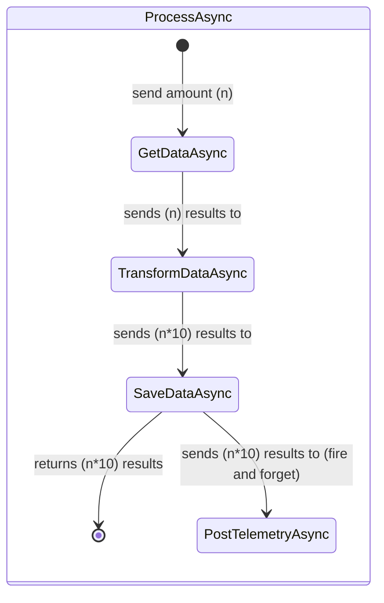

                        █████▄  ▄▄▄    ▄███████▓▄▄▄       ███████     ▒█████  █     █░
                        ██  ▀██▒████▄  ▒  ██▒ ▓▒████▄   ▓██   ▓██▒   ▒██▒  ██▓█░ █ ░█░
                        ██   ██▒██  ▀█▄░ ▓██░ ▒▒██  ▀█▄ ▒████ ▒██░   ▒██░  ██▒█░ █ ░█ 
                        ██  ▄█▓░██▄▄▄▄██ ▓██▓ ░░██▄▄▄▄██░▓█▒  ▒██░   ▒██   ██░█░ █ ░█ 
                        █████▓▒ ██   ▓██▒▒██▒ ░ ██   ▓██░▒█░  ░██████░ ████▓▒░░██▒██▓ 
                        ▓▒▒▓  ▒ ▒▒   ▓▒█░▒ ░░   ▒▒   ▓▒█░▒ ░  ░ ▒░▓  ░ ▒░▒░▒░░ ▓░▒ ▒  
                         ░ ▒  ▒  ▒   ▒▒ ░  ░     ▒   ▒▒ ░░    ░ ░ ▒  ░ ░ ▒ ▒░  ▒ ░ ░  
                         ░ ░  ░  ░   ▒   ░       ░   ▒   ░ ░    ░ ░  ░ ░ ░ ▒   ░   ░  
                           ░         ░  ░            ░  ░         ░  ░   ░ ░     ░    
                         ░                                                            

*TLDR: the different methods are within the Features folder*

 There are various approaches to process data efficiently, each with its own trade-offs. In this demo, I have created three different strategies: TPL Dataflow, which utilizes a network of concurrently executing blocks; Semaphore-based control, which simply limits the number of tasks running in parallel; and Single-threaded processing, which executes tasks sequentially without any concurrency.

### Dataflow (TPL Dataflow)

Task Parallel Library (TPL) Dataflow is ideal for building high-performance, data-driven applications. This approach constructs a processing pipeline using different blocks (like TransformManyBlock, TransformBlock, BroadcastBlock, etc.), each handling a specific type of processing. The blocks are linked, creating a complex data processing pipeline. Execution options are used to control concurrency levels, with the MaxDegreeOfParallelism property set to `Environment.ProcessorCount` for certain blocks (simulated CPU processes), allowing this many concurrent operations. Other blocks are configured to have an unbounded degree of parallelism (simulated I/O tasks). The model ensures that the completion status and exceptions are propagated through the pipeline.

### Semaphore

Semaphores are synchronization primitives that maintain a count representing the number of allowed accesses to a resource. This approach uses a SemaphoreSlim object with an initial count of `Environment.ProcessorCount`(for simulated CPU processes, simulated I/O tasks are ran all at once), allowing up to this many concurrent operations. The tasks must acquire the semaphore before processing and release it afterward.

### Sequential Processing with Asynchronous Tasks

This approach performs processing sequentially but leverages asynchronous tasks to prevent blocking. The method fetches, transforms, saves, and posts telemetry data one item at a time. While tasks are asynchronous, they are executed sequentially for each item.

## Dataflow/Semaphore/Sequential ProcessAsync
The following diagram provides a visual representation of the workflow executed by the ProcessAsync method:

## K6 Load Testing

These results represent the performance of three different processing approaches: Dataflow, Semaphore, and Sequential Processing with Asynchronous Tasks. Each approach is tested with a load script for 1 minute and 10 virtual users (VUs).

### Dataflow (loadTestDataflowProcess.js):
* Total of 1557 iterations completed.
* 100% of HTTP requests received status code 200.
* The average request duration was around 193 milliseconds.
* Data received at a rate of approximately 108 kB/s.
* Average iteration duration was around 386 milliseconds.

### Semaphore (loadTestSemaphoreProcess.js):
* Total of 1512 iterations completed.
* 100% of HTTP requests received status code 200.
* The average request duration was around 199 milliseconds.
* Data received at a rate of approximately 104 kB/s.
* Average iteration duration was around 399 milliseconds.

### Sequential Processing with Asynchronous Tasks (loadTestSingleProcess.js):
* Total of 30 iterations completed.
* 100% of HTTP requests received status code 200.
* The average request duration was considerably higher, around 10.36 seconds.
* Data received at a rate of approximately 2.2 kB/s.
* Average iteration duration was around 20.72 seconds.

## Gantt Diagrams

The following diagrams illustrate three different approaches to processing data: a sequential process, a semaphore process, and a dataflow process. Both semaphore and dataflow have a concurrency limit of 4 for CPU task (red) and no limit on I/O tasks. Each approach executes a set process in which it:
1. Retreives *n* amount of data (70ms simulated I/O)
2. Transforms that data into *n*\*2 items (30ms simulated CPU per req(*n*))
3. Saves those items and return an id (70ms simulated I/O per req(*n*\*2))
4. Posts the id as telemetry data (50ms simulated I/O per req(*n*\*2)) (fire and forget)

```mermaid
    gantt
        title Single process (20)
        dateFormat x
        axisFormat %L
        section Single
            GetDataAsync (20) : 1, 85ms
            TransformDataAsync (0) :crit, 94, 39ms
            SaveDataAsync (0) : 134, 80ms
            PostTelemetryAsync (0) : 215, 58ms
            SaveDataAsync (0) : 214, 75ms
            TransformDataAsync (1) :crit, 289, 32ms
            PostTelemetryAsync (0) : 289, 63ms
            SaveDataAsync (1) : 321, 77ms
            PostTelemetryAsync (1) : 398, 63ms
            SaveDataAsync (1) : 398, 78ms
            TransformDataAsync (2) :crit, 477, 30ms
            PostTelemetryAsync (1) : 477, 61ms
            SaveDataAsync (2) : 507, 78ms
            PostTelemetryAsync (2) : 585, 62ms
            SaveDataAsync (2) : 585, 77ms
            TransformDataAsync (3) :crit, 663, 40ms
            PostTelemetryAsync (2) : 663, 62ms
            SaveDataAsync (3) : 705, 83ms
            PostTelemetryAsync (3) : 788, 62ms
            SaveDataAsync (3) : 788, 78ms
            TransformDataAsync (4) :crit, 866, 45ms
            PostTelemetryAsync (3) : 866, 61ms
            SaveDataAsync (4) : 911, 77ms
            PostTelemetryAsync (4) : 988, 62ms
            SaveDataAsync (4) : 988, 77ms
            TransformDataAsync (5) :crit, 1065, 31ms
            PostTelemetryAsync (4) : 1065, 63ms
            SaveDataAsync (5) : 1096, 79ms
            PostTelemetryAsync (5) : 1175, 63ms
            SaveDataAsync (5) : 1175, 79ms
            TransformDataAsync (6) :crit, 1254, 30ms
            PostTelemetryAsync (5) : 1254, 63ms
            SaveDataAsync (6) : 1285, 77ms
            PostTelemetryAsync (6) : 1362, 63ms
            SaveDataAsync (6) : 1362, 79ms
            TransformDataAsync (7) :crit, 1441, 31ms
            PostTelemetryAsync (6) : 1441, 62ms
            SaveDataAsync (7) : 1472, 77ms
            PostTelemetryAsync (7) : 1549, 62ms
            SaveDataAsync (7) : 1549, 77ms
            TransformDataAsync (8) :crit, 1626, 32ms
            PostTelemetryAsync (7) : 1626, 64ms
            SaveDataAsync (8) : 1658, 78ms
            PostTelemetryAsync (8) : 1736, 62ms
            SaveDataAsync (8) : 1736, 78ms
            TransformDataAsync (9) :crit, 1814, 31ms
            PostTelemetryAsync (8) : 1814, 63ms
            SaveDataAsync (9) : 1845, 79ms
            PostTelemetryAsync (9) : 1924, 62ms
            SaveDataAsync (9) : 1924, 77ms
            TransformDataAsync (10) :crit, 2001, 31ms
            PostTelemetryAsync (9) : 2001, 62ms
            SaveDataAsync (10) : 2032, 78ms
            PostTelemetryAsync (10) : 2110, 62ms
            SaveDataAsync (10) : 2110, 77ms
            TransformDataAsync (11) :crit, 2187, 31ms
            PostTelemetryAsync (10) : 2188, 61ms
            SaveDataAsync (11) : 2219, 78ms
            PostTelemetryAsync (11) : 2297, 62ms
            SaveDataAsync (11) : 2297, 77ms
            TransformDataAsync (12) :crit, 2374, 31ms
            PostTelemetryAsync (11) : 2374, 63ms
            SaveDataAsync (12) : 2405, 79ms
            PostTelemetryAsync (12) : 2485, 61ms
            SaveDataAsync (12) : 2485, 76ms
            TransformDataAsync (13) :crit, 2561, 32ms
            PostTelemetryAsync (12) : 2561, 63ms
            SaveDataAsync (13) : 2593, 77ms
            PostTelemetryAsync (13) : 2671, 61ms
            SaveDataAsync (13) : 2671, 77ms
            TransformDataAsync (14) :crit, 2748, 31ms
            PostTelemetryAsync (13) : 2748, 62ms
            SaveDataAsync (14) : 2779, 77ms
            PostTelemetryAsync (14) : 2857, 62ms
            SaveDataAsync (14) : 2856, 78ms
            TransformDataAsync (15) :crit, 2935, 30ms
            PostTelemetryAsync (14) : 2935, 62ms
            SaveDataAsync (15) : 2965, 78ms
            PostTelemetryAsync (15) : 3043, 62ms
            SaveDataAsync (15) : 3043, 78ms
            TransformDataAsync (16) :crit, 3121, 31ms
            PostTelemetryAsync (15) : 3121, 63ms
            SaveDataAsync (16) : 3152, 78ms
            PostTelemetryAsync (16) : 3230, 61ms
            SaveDataAsync (16) : 3230, 77ms
            TransformDataAsync (17) :crit, 3307, 31ms
            PostTelemetryAsync (16) : 3307, 63ms
            SaveDataAsync (17) : 3338, 78ms
            PostTelemetryAsync (17) : 3416, 61ms
            SaveDataAsync (17) : 3416, 76ms
            TransformDataAsync (18) :crit, 3493, 31ms
            PostTelemetryAsync (17) : 3493, 63ms
            SaveDataAsync (18) : 3524, 79ms
            PostTelemetryAsync (18) : 3603, 62ms
            SaveDataAsync (18) : 3603, 78ms
            TransformDataAsync (19) :crit, 3681, 31ms
            PostTelemetryAsync (18) : 3682, 60ms
            SaveDataAsync (19) : 3712, 77ms
            PostTelemetryAsync (19) : 3789, 62ms
            SaveDataAsync (19) : 3789, 77ms
```

```mermaid
    gantt
        title Semaphore process (20)
        dateFormat x
        axisFormat %L
        section Semaphore
            GetDataAsync (20) : 1, 75ms
            TransformDataAsync (19) :crit, 98, 41ms
            TransformDataAsync (2) :crit, 99, 40ms
            TransformDataAsync (0) :crit, 98, 41ms
            TransformDataAsync (1) :crit, 98, 41ms
            TransformDataAsync (3) :crit, 140, 45ms
            TransformDataAsync (4) :crit, 140, 45ms
            TransformDataAsync (6) :crit, 140, 46ms
            TransformDataAsync (5) :crit, 140, 45ms
            TransformDataAsync (9) :crit, 186, 31ms
            TransformDataAsync (10) :crit, 186, 31ms
            TransformDataAsync (11) :crit, 186, 31ms
            TransformDataAsync (8) :crit, 186, 31ms
            SaveDataAsync (0) : 146, 71ms
            SaveDataAsync (19) : 146, 71ms
            SaveDataAsync (2) : 146, 71ms
            SaveDataAsync (19) : 146, 71ms
            SaveDataAsync (2) : 146, 71ms
            SaveDataAsync (1) : 146, 71ms
            SaveDataAsync (0) : 146, 71ms
            SaveDataAsync (1) : 146, 71ms
            TransformDataAsync (15) :crit, 218, 45ms
            TransformDataAsync (12) :crit, 217, 46ms
            TransformDataAsync (13) :crit, 218, 45ms
            TransformDataAsync (14) :crit, 218, 45ms
            SaveDataAsync (5) : 186, 78ms
            SaveDataAsync (3) : 186, 78ms
            SaveDataAsync (4) : 186, 77ms
            SaveDataAsync (4) : 186, 78ms
            SaveDataAsync (6) : 186, 78ms
            SaveDataAsync (5) : 186, 78ms
            SaveDataAsync (6) : 186, 78ms
            SaveDataAsync (3) : 186, 79ms
            PostTelemetry (19) : 223, 57ms
            PostTelemetry (0) : 223, 57ms
            PostTelemetry (1) : 223, 57ms
            PostTelemetry (2) : 223, 57ms
            PostTelemetry (1) : 222, 58ms
            PostTelemetry (2) : 222, 58ms
            PostTelemetry (0) : 222, 59ms
            PostTelemetry (19) : 222, 58ms
            SaveDataAsync (11) : 218, 77ms
            SaveDataAsync (9) : 217, 78ms
            SaveDataAsync (11) : 218, 77ms
            SaveDataAsync (8) : 218, 77ms
            SaveDataAsync (10) : 218, 77ms
            SaveDataAsync (10) : 218, 77ms
            SaveDataAsync (8) : 218, 77ms
            SaveDataAsync (9) : 217, 80ms
            TransformDataAsync (7) :crit, 264, 33ms
            TransformDataAsync (18) :crit, 264, 33ms
            TransformDataAsync (17) :crit, 264, 33ms
            TransformDataAsync (16) :crit, 264, 33ms
            PostTelemetry (4) : 265, 60ms
            PostTelemetry (6) : 265, 60ms
            PostTelemetry (6) : 265, 60ms
            PostTelemetry (3) : 265, 60ms
            PostTelemetry (3) : 265, 60ms
            PostTelemetry (5) : 265, 60ms
            PostTelemetry (5) : 265, 60ms
            PostTelemetry (4) : 264, 61ms
            SaveDataAsync (13) : 264, 76ms
            SaveDataAsync (13) : 264, 76ms
            SaveDataAsync (15) : 264, 76ms
            SaveDataAsync (14) : 264, 76ms
            SaveDataAsync (14) : 264, 76ms
            SaveDataAsync (12) : 264, 76ms
            SaveDataAsync (15) : 264, 76ms
            SaveDataAsync (12) : 264, 76ms
            PostTelemetry (11) : 295, 61ms
            PostTelemetry (8) : 295, 61ms
            PostTelemetry (11) : 295, 61ms
            PostTelemetry (9) : 298, 58ms
            PostTelemetry (9) : 301, 55ms
            PostTelemetry (8) : 295, 61ms
            PostTelemetry (10) : 295, 61ms
            PostTelemetry (10) : 295, 61ms
            SaveDataAsync (7) : 298, 74ms
            SaveDataAsync (17) : 298, 74ms
            SaveDataAsync (16) : 303, 69ms
            SaveDataAsync (18) : 298, 74ms
            SaveDataAsync (18) : 301, 71ms
            SaveDataAsync (16) : 298, 74ms
            SaveDataAsync (17) : 302, 70ms
            SaveDataAsync (7) : 302, 70ms
```

```mermaid
    gantt
        title Dataflow process (20)
        dateFormat x
        axisFormat %L
        section Dataflow
            GetDataAsync (20) : 27, 75ms
            TransformDataAsync (1) :crit, 119, 44ms
            TransformDataAsync (0) :crit, 119, 44ms
            TransformDataAsync (3) :crit, 119, 44ms
            TransformDataAsync (2) :crit, 119, 44ms
            TransformDataAsync (7) :crit, 165, 30ms
            TransformDataAsync (5) :crit, 164, 31ms
            TransformDataAsync (4) :crit, 164, 31ms
            TransformDataAsync (6) :crit, 164, 31ms
            TransformDataAsync (8) :crit, 195, 31ms
            TransformDataAsync (10) :crit, 197, 44ms
            TransformDataAsync (11) :crit, 197, 44ms
            TransformDataAsync (9) :crit, 196, 45ms
            SaveDataAsync (0) : 174, 71ms
            SaveDataAsync (0) : 174, 71ms
            SaveDataAsync (1) : 174, 71ms
            SaveDataAsync (1) : 174, 71ms
            SaveDataAsync (2) : 177, 70ms
            SaveDataAsync (3) : 177, 70ms
            SaveDataAsync (2) : 177, 70ms
            SaveDataAsync (3) : 177, 71ms
            TransformDataAsync (12) :crit, 227, 44ms
            SaveDataAsync (6) : 197, 74ms
            SaveDataAsync (6) : 197, 74ms
            SaveDataAsync (4) : 195, 76ms
            SaveDataAsync (5) : 197, 74ms
            SaveDataAsync (7) : 197, 74ms
            SaveDataAsync (5) : 197, 75ms
            SaveDataAsync (7) : 197, 74ms
            SaveDataAsync (4) : 195, 76ms
            TransformDataAsync (13) :crit, 241, 35ms
            TransformDataAsync (14) :crit, 241, 35ms
            TransformDataAsync (15) :crit, 241, 35ms
            SaveDataAsync (8) : 227, 75ms
            SaveDataAsync (8) : 227, 75ms
            PostTelemetry (0) : 247, 56ms
            PostTelemetry (1) : 247, 56ms
            PostTelemetry (3) : 248, 55ms
            PostTelemetry (2) : 247, 56ms
            PostTelemetry (3) : 248, 55ms
            PostTelemetry (0) : 247, 56ms
            PostTelemetry (1) : 247, 56ms
            PostTelemetry (2) : 247, 56ms
            TransformDataAsync (18) :crit, 277, 40ms
            TransformDataAsync (16) :crit, 271, 46ms
            TransformDataAsync (19) :crit, 277, 40ms
            TransformDataAsync (17) :crit, 277, 40ms
            SaveDataAsync (10) : 241, 76ms
            SaveDataAsync (11) : 242, 75ms
            SaveDataAsync (10) : 241, 76ms
            SaveDataAsync (11) : 241, 76ms
            SaveDataAsync (9) : 241, 76ms
            SaveDataAsync (9) : 241, 76ms
            PostTelemetry (6) : 278, 55ms
            PostTelemetry (7) : 279, 54ms
            PostTelemetry (4) : 278, 55ms
            PostTelemetry (5) : 278, 55ms
            PostTelemetry (7) : 279, 54ms
            PostTelemetry (6) : 278, 55ms
            PostTelemetry (5) : 278, 55ms
            PostTelemetry (4) : 273, 60ms
            SaveDataAsync (13) : 277, 72ms
            SaveDataAsync (15) : 278, 71ms
            SaveDataAsync (12) : 273, 76ms
            SaveDataAsync (14) : 278, 71ms
            SaveDataAsync (12) : 273, 76ms
            SaveDataAsync (13) : 277, 72ms
            SaveDataAsync (15) : 278, 71ms
            SaveDataAsync (14) : 277, 72ms
            PostTelemetry (8) : 303, 62ms
            PostTelemetry (8) : 303, 62ms
            PostTelemetry (9) : 318, 63ms
            PostTelemetry (11) : 318, 63ms
            PostTelemetry (10) : 318, 63ms
            PostTelemetry (9) : 318, 63ms
            PostTelemetry (11) : 318, 63ms
            PostTelemetry (10) : 318, 63ms
            SaveDataAsync (17) : 318, 79ms
            SaveDataAsync (17) : 318, 79ms
            SaveDataAsync (18) : 318, 79ms
            SaveDataAsync (18) : 318, 79ms
            SaveDataAsync (16) : 318, 79ms
            SaveDataAsync (19) : 318, 79ms
            SaveDataAsync (19) : 318, 79ms
            SaveDataAsync (16) : 318, 79ms
            PostTelemetry (12) : 349, 49ms
            PostTelemetry (12) : 349, 49ms
            PostTelemetry (15) : 350, 48ms
            PostTelemetry (14) : 350, 48ms
            PostTelemetry (14) : 350, 48ms
            PostTelemetry (13) : 349, 49ms
```

